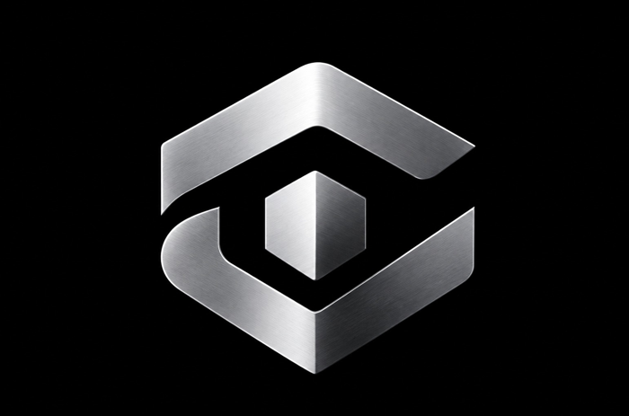

<div align="center">

# Saadullah Abdul Wahid

### Founder & CEO @ CodenSec · Red Teamer · CEH v13 Certified

<table>
<tr>
<td width="58%" valign="middle">

<a href="https://readme-typing-svg.demolab.com/?font=Fira+Code&size=21&duration=2600&pause=850&color=50F727&center=false&vCenter=true&width=650&lines=Hello%2C+I'm+Saadullah+Abdul+Wahid;Founder+%26+CEO+%40+CodenSec;Red+Teamer+%7C+CEH+v13+Certified;Full-Stack+Developer+%7C+Offensive+Security;Security+Research+%7C+Security+Tool+Development;Automation+%7C+Linux+%7C+Python">

</a>

<br>

```text
$ whoami
saadullah-abdul-wahid
$ ./focus
offensive-security • research • engineering
```

</td>
<td width="42%" align="center" valign="middle">

<a href="https://codensec.com/">

</a>

</td>
</tr>
</table>

<br><br>

<a href="https://www.linkedin.com/in/saadullah-abdul-wahid-142643393?utm_source=share_via&utm_content=profile&utm_medium=member_ios"></a>&nbsp;&nbsp;&nbsp;
<a href="https://x.com/saadullahabd?s=11"></a>&nbsp;&nbsp;&nbsp;
<a href="https://www.tiktok.com/@roothackerslab"></a>&nbsp;&nbsp;&nbsp;
<a href="https://codensec.com/"></a>

</div>

---

## `$ cat profile.txt`

```text
NAME        : Saadullah Abdul Wahid
ROLE        : Founder & CEO @ CodenSec
SECURITY    : Red Teaming / Offensive Security
CERTIFIED   : CEH v13
ENGINEERING : Full-Stack Development
RESEARCH    : Security Research & Tool Development
AUTOMATION  : Python / Linux / Scripting
APPROACH    : Build → Break → Understand → Secure
```

I am a **Founder & CEO, Red Teamer, and Full-Stack Developer** focused on building practical technology at the intersection of **offensive security, security research, software engineering, automation, and security tool development**.

My work combines **Python, Linux, web technologies, and security engineering** to create useful systems, research tooling, and automation for **authorized testing and controlled environments**.

## `$ ./skills`

### Offensive Security

<div align="center">

<a href="https://www.python.org/"></a>&nbsp;
<a href="https://www.linux.org/"></a>&nbsp;
<a href="https://www.kali.org/"></a>&nbsp;
<a href="https://www.torproject.org/"></a>&nbsp;
<a href="https://git-scm.com/"></a>&nbsp;
<a href="https://www.gnu.org/software/bash/"></a>

</div>

### Full-Stack Engineering

<div align="center">

<a href="https://developer.mozilla.org/en-US/docs/Web/HTML"></a>&nbsp;
<a href="https://developer.mozilla.org/en-US/docs/Web/JavaScript"></a>&nbsp;
<a href="https://react.dev/"></a>&nbsp;
<a href="https://nodejs.org/"></a>&nbsp;
<a href="https://www.docker.com/"></a>

</div>

## `$ ./mission`

```bash
$ echo "What I build"
> security research tooling
> offensive-security utilities
> full-stack web applications
> automation workflows
> developer & security tooling

$ echo "Operating principle"
> Build it.
> Break it.
> Understand it.
> Secure it.
```

## `$ ./connect`

<div align="center">

<a href="https://www.linkedin.com/in/saadullah-abdul-wahid-142643393?utm_source=share_via&utm_content=profile&utm_medium=member_ios"></a>&nbsp;&nbsp;&nbsp;&nbsp;
<a href="https://x.com/saadullahabd?s=11"></a>&nbsp;&nbsp;&nbsp;&nbsp;
<a href="https://www.tiktok.com/@roothackerslab"></a>&nbsp;&nbsp;&nbsp;&nbsp;
<a href="https://codensec.com/"></a>

</div>
